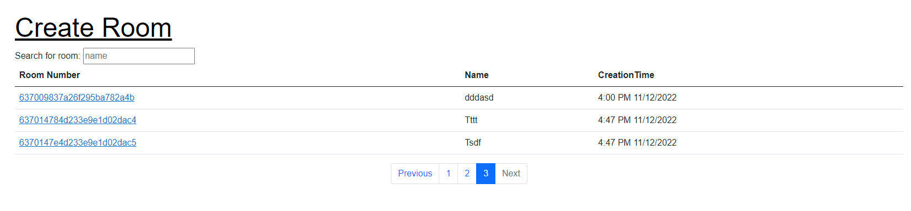

# Guide

The only thing that needs configured to get this working is
the ChatRoomService in the Services folder. Enter your desired
database, collection, and connection string and things will be up
and running.
Side Note: Application was built with authorization and authentication
but there is no need to create an account.

